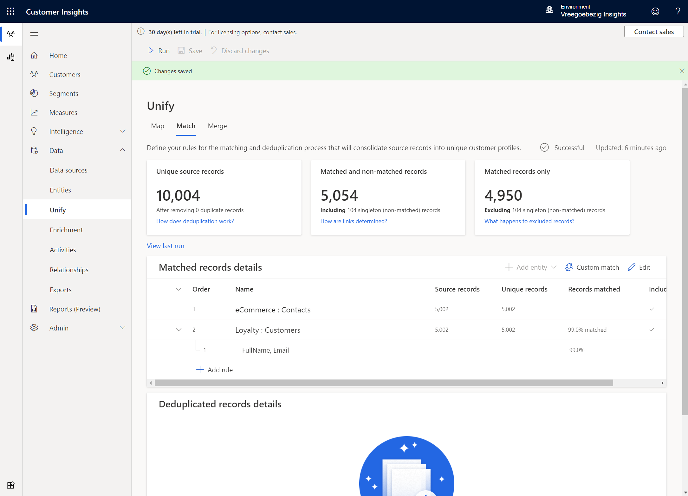
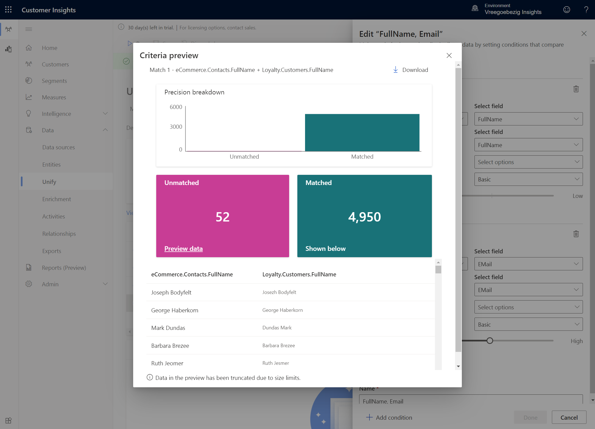
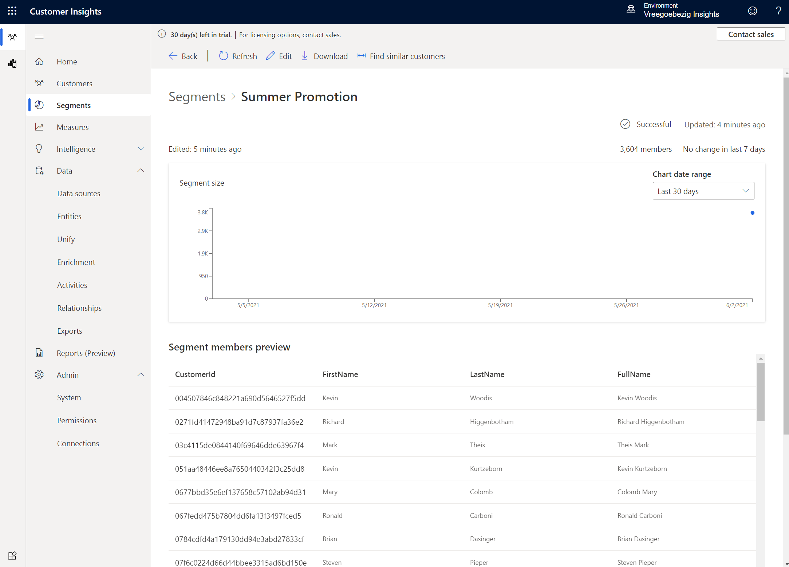
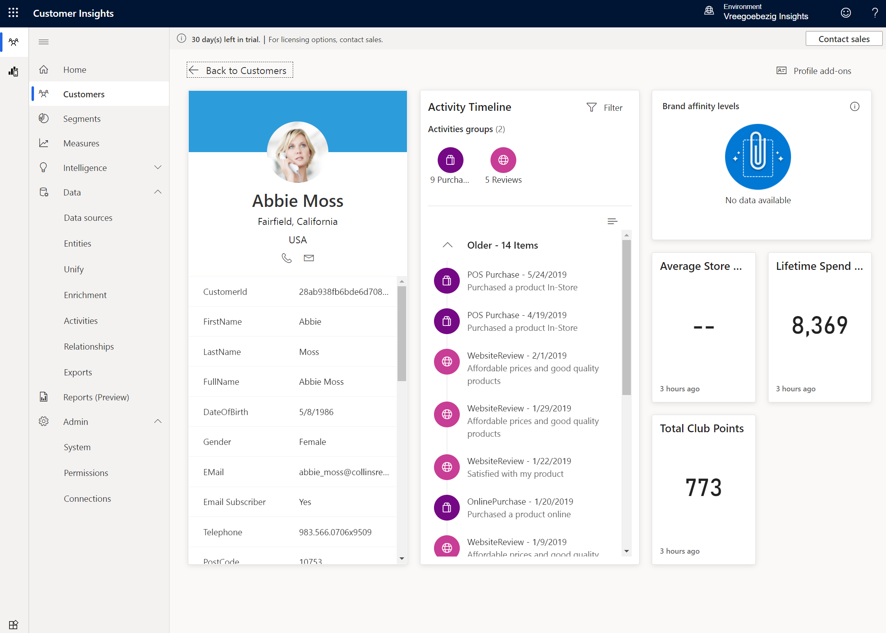
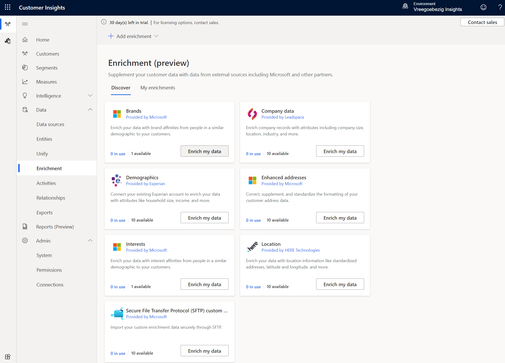
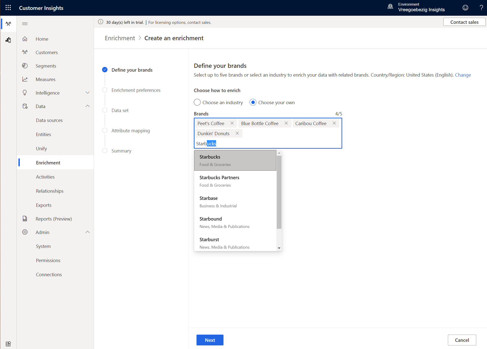
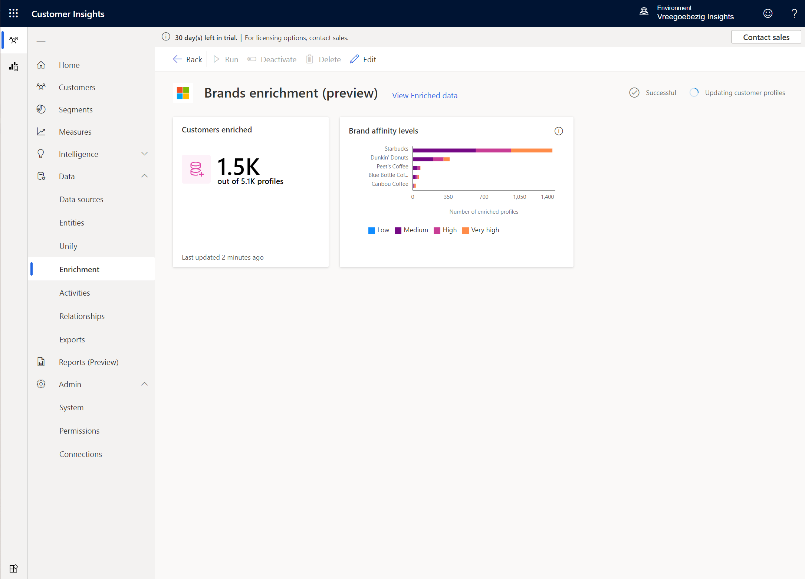

# Customer Insights

Get insights about **who** your customers are, or about **how** they are engaging with your business. 

Change your focus **at any time** by using the navigation menu:

## Data Sources

- eCommerceContacts Extract of Customers who have made an online purchase: https://aka.ms/CI-ILT/Contacts 
- LoyaltyScheme Extract of Customers who’ve signed-up for the Contoso Retail Loyalty Card Scheme: https://aka.ms/CIILT/LoyaltySchemeCustomers 
- OnlinePurchases Extract of purchases made via the Contoso Retail Website: https://aka.ms/CIILT/OnlinePurchases 
- POSPurchases Extract of in-store purchase detail:https://aka.ms/CI-ILT/POSPurchases
- WebsiteReviews Online Website Reviews from online users: https://aka.ms/CI-ILT/WebReviews

## Data Ingestion

## Data Unification

Map fields to common model types:

Next we needs to set the match order:

Specify the match rules:

When you run the match process you get to see the number exact matches based on the rule(s) set:

When you set the precision for full name to low you'll get more matches:

To see the match results open the **Match preview** where you also see the **confidence score** for each match:

You can also check the match preview per condition (criteria), here for instance for the FullName condition:

The last step in the unification process is about reconciling conflicting data, which you do in the **Merge** step, allowing you to decide which version of the field should chosen and what the display will be in the merged profile, here for instance for the First Name field:

## Relationships

In order to create measure we first need to create relationships between the various entities.

## Measures

By deleting the customer dimension, these changes the measure from a **customer measure** to a **business measure**:

In this business measure we calculate the average total spend per purchase:

Here's an example of a customer measure:

You can review the measures under **Data** > **Entities**:

Click **Customer_Measure** here and then the **Data** tab:

Back in the **Attributes** tab click the **Summaru** icon next to the **Total Club Points** measure:

## Segments

New dynamic segment from measure:

New dynamic segment from blank:

Review your segments:

Segments can be exported:

## Segment Insights

Create a segment insight of type **Differentiator**:

Create a segment insight of type **Overlap**:

## Segment Expansion

Segment Expansion can be used to find similar customers to your segment customer base using 
Artificial Intelligence. 

Earlier we created a segment called Summer Promotion which has millennial customers with 
higher than average instore purchase. Now, let us expand that segment and find customers that 
are similar to them for us to market our newly launched Cold Brew Coffee. 

## Activities

See the result:

## Data Enrichment

Another one for interests:

Review the result:

