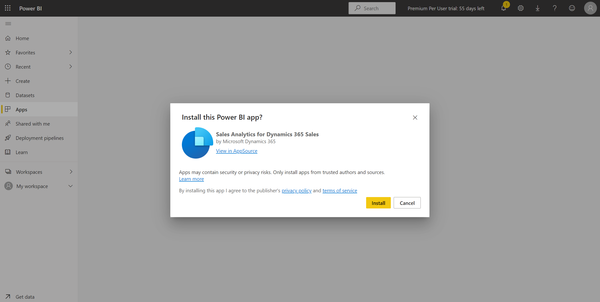

# Sales Analytics for Dynamics 365 Sales

Get it from AppSource: https://appsource.microsoft.com/en-us/product/power-bi/microsoftd365.salesanalytics

Click **Get it Now**, then fill out the requested information and then click **Continue**:

In Power BI click **Install**:

Once installed click the **Sales Analytics for Dynamics 365 Sales** tile that was added:

Show the various dashboards:

