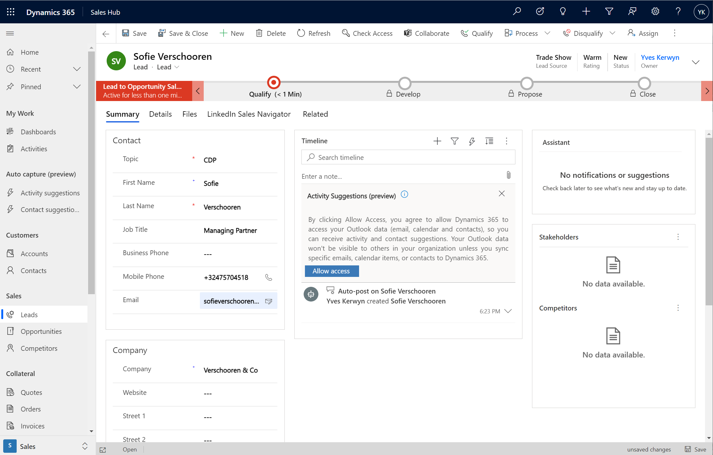
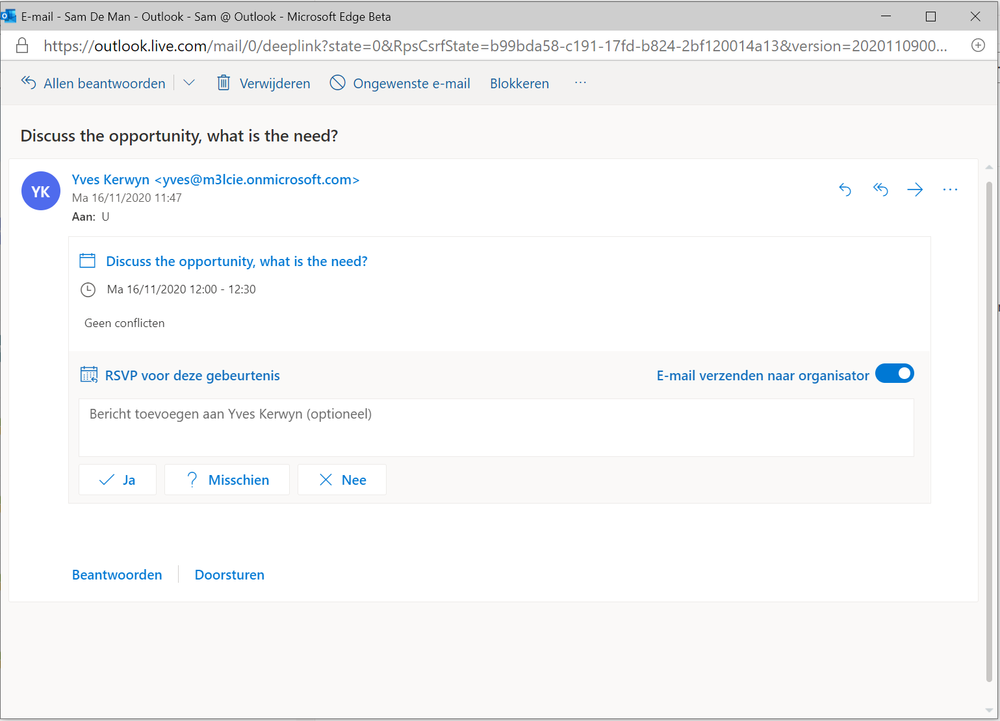
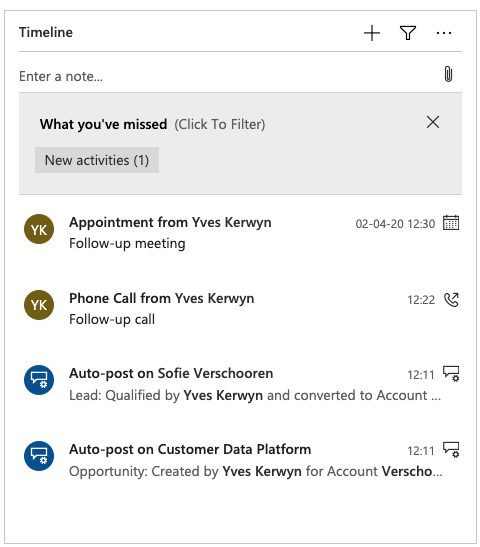
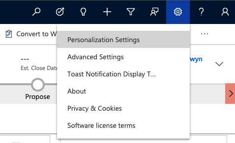
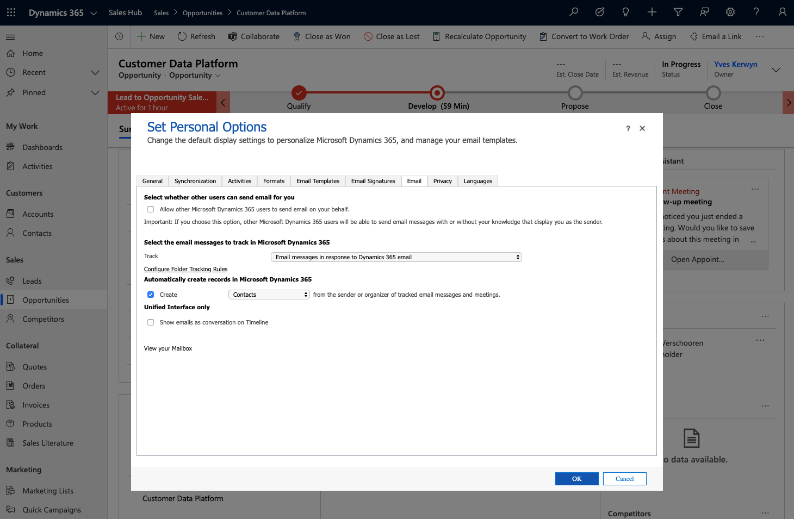
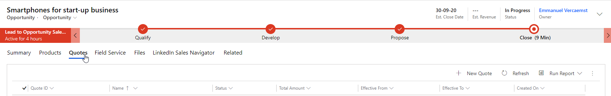
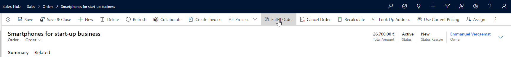

# Sales Demo

From [Dynamics 365 Home](https://home.dynamics.com/) go to **Sales Hub**:

Start by explaining the setup of the Dynamics 365 **Sales Hub** app. 

Cover the following:

- Sitemap (left side of your screen)
- You can click the sitemap away to have a bigger view of the necessities
- Recently opened pages
- Pinned pages
- Accounts vs Contacts
- Leads vs Opportunities
- Quotes, Orders, Invoices, Products
- App Settings

## Leads

Under **Sales** click **Leads**:

Create a new lead:

- Lead Source: **Trade Show**
- Rating: **Warm**
- Topic: **CDP**
- First Name: **Sofie**
- Last Name: **Verschooren**
- Job Title: **Managing Partner**
- Mobile Phone: **+32475704518**
- Email: **sofieverschooren@outlook.com**
- Company: **Verschooren & Co**

Click **Save**.

When this is your first use you will be requested Dynamics 365 to access your Outlook data (email, calendar and contacts), so you can receive activity and contact suggestions:

Click **Allow access**.

Discuss:
- First entry in the timeline
- Stage

Update the "BANT" (Budget - Authority - Need - Timing) details in the first stage:
- Existing Contact: **<leave blanc>**
- Existing Account: **<leave blanc>**
- Purchase Timeframe:  **This Quarter**
- Purchase Budget: **20.000**
- Purchase Process: **Individual**
- Identify Decision Maker: **Completed**
- Capture Summary: **Need for better data-driven approach**

Go back to the home page and go to the lead that you've just created. 

Now discuss the different views you can enable for each list.

Let's discuss the **Sales Navigator** plugin in Dynamics 365 to view the leads' information.

## Qualify

Since we are not sure whether we can qualify our lead as an opportunity, we'll first plan a follow-up call with the customer, by clicking the **+** sign in the **Timeline** and then **Phone Call** under **Activity**:

In the **Quick Create** pane that shows up specify a **Subject** and a **Phone number**, and click **Save and Close**:

Howering over the newly created activity will bring up a set of little acticity icons:

By clicking the left most activity icon you can assign the phone call to a colleague:

As a result the activity will appear as a new activity for your colleague, who can access his activities via the site map under **My Work**:

Clicking the activity opens the activity in a pop-up window where you can mark the activity as completed by clicking **Mark Complete**:

Back on the new lead form click **Qualify**:

At this point the contact you specified might already exist, in that case Sales Hub will invite you to confirm the match:

If the contact is new it will be created.

Discuss:
- Lead becomes read-only
- Account is created
- Contact is created
- Opportunity is created

We are actually seeing the newly created opportunity:

Next we will create a new appointment to discuss the details of the possible sales.

Click again the **+** sign in the **Timeline** and then click **Activity** | **Appointment**:

In the **Quick Create** pane that appears enter a **Subject** and click **Save and Close**:

The customer will be invited by email to the meeting:

> Note that we will discuss later that emails sent to Dynamics 365 contacts can be auto captured and suggested as new activities once configured to do so. In case auto capture was already configured the invitation that was just sent will automatically appear as an new activity, making it visible for all members of the sales team associated with this opportinuty. Alternativelly you can also go to Outlook and explicitly mark this email to be tracked by Dynamics 365 as an activity for the opportunity using the **Dynamics 365 Sales App for Outlook** that will also be discussed below.

Notice that the **Assistant** section is currently still empty. Click **Refresh**:

After having clicked **Refresh** an upcomming meeting notification for your appointment will appear in the **Assistant** section:

Next, let's add one of your colleagues as a member of the sales team for this new opportunity, by clicking the **+ New Connection** in the **Sales team** menu:

In the follow-up call that happened we realized that the assistant of Sofie is a stakeholder as well. We should add her to the **Stakeholders**, by clicking **+ New Connection** in the **Stakeholders** menu:

Now Discuss the following:
- Opportunity fields:
  - Estimated Close Date
  - Estimated Revenue
  - Current Situation 
  - Customer Need
  - Proposed Solution
- Updated Timeline
- Stakeholders section now includes contact
- Sales team section

Show the **Development** stage details in the business process flow:

Specify:
- Current Situation: **Having little insight about their customers.**
- Customer Need: **360-view on customers.**
- Proposed Solution: **Dynamics 365 Sales + Customer Insights.**

Hit **Save** and show that the stage is updated:

## Business Process Flow (optional)

Show how to create or customize a Business Process Flow.

Go to the [Power Apps Maker Portal](https://make.powerapps.com), and navigate to the **Business process flows** (tab) via **Flows** in the sitemap:

Open the **Opportunity Sales Process**:

## Dynamics 365 App for Outlook

Switch to **Outlook** and show that the meeting was nicely synced to Outlook:

Let's now create an additional appointment, this time from Outlook:

After having specified **Meeting other stakeholders** as the title/subject of the meeting you will discover that Outlook will suggest attendees that you have already been inviting previously when creating appointments in Dynamics 365 Sales:

Next click the elipses from menu and select **Dynamics 365** to bring up the **Dynamics 365 App for Outlook** add-in:

From the **Dynamics 365 App for Outlook** add-in you have several options to mark the meeting as to be tracked by Dynamics 365.

First option is to click the elipses next to **Not tracked** and select **Track without Regarding**:

Another option to mark this meeting as to be tracked by Dynamics 365 is clicking the **Set Regarding** field which brings up a **Look for Records** field where you can specify with which Dynamics 365 record you want to associate this meeting:  

Below the **Look for Records** field you can select any of the recent Dynamics 365 records, e.g. the opportunity record you just created, or by clicking **All records** link you can select from a list with all existing records. If the Dynamics 365 record with which you want to associate the meeting doen't exist yet you can also create here by clicking **+ New Record** from where you are guided to create any type of new Dynamics 365 record:

Let's go for the **track regarding** option by selecting the new opportunity record:

If you choose to have this meeting not tracked by Dynamics 365, then the meeting will not show up in the timeline of any Dynamics 365 record, unless auto capture was configured to auto track meetings.

> See [Which activities are captured?](https://docs.microsoft.com/en-us/dynamics365/ai/sales/free-auto-capture#which-activities-are-captured) to undestand whixh activities are track with Auto Capture.

For the sake the demo you might also want to create another meeting, but without keep it untracted in order to show the difference. However be aware that in case premium auto capture is enabled that meetings will most problably still show up as suggested activities. So review the **Sales Insights settings**:

Switch back to the opportunity and see the **What you've missed** filter in the Timeline, showing untracked emails and/or meetings that got captured by Auto Capture:

Open the mailbox of Sofie and send a message to yourself:

In Outlook open the received e-mail and explicitly **track the e-mail**:

In Dynamics 365 Sales Hub refresh the timeline:

As a result now the email shows up:

## Auto Capture

Click the gear button on the navigation bar, and then choose **Personalization Settings** from the menu:

Click the **Email** tab:

Update which emails should be tracked automatically, the default is **Email messages in response to Dynamics 365 email**, change it it **Email messages from Dynamics 365 Leads, Contacts and Accounts**:

Send again a new mail from Sofie to your mailbox:

The **Auto Capture** feature should pick up this e-mail and show it in the timelime of the contact:

Note that at this point the received email will only be visible to you, not to any of your colleagues. In order to make this email also visible to your colleagues the **Sync and connect** icon that appears when you hover over the suggested activity in the timeline.

This will bring up following pop-up:

Check the **Sales Insights Settings**:

Make sure that at least **Basic auto capture** is enabled:

## Connect your Opportunity to Microsoft Teams

We'll now connect our opportunity to Microsoft Teams so we can collaborate on it. Click on **Collaborate**:

This brings up the following wizard dialog, start by clicking **Get Started**:

Next select the existing team and then click **Next**:

Let's create a new channel by clicking **+ Create ngit aew Channel**:

Specify a name for the new channel, e.g. **Hot Opportunities** and click **Next**:

And finally select the members for the new channel and click **Finish**:

For the result click **Cancel** and then **Use the web app instead**:

This opens your new Teams channel in the Teams web app:

## Attaching documents to Leads/Opportunities

It is very useful to attach documents to leads or opportunities. Dynamics 365 Sales provides of an interesting feature for this.

Go to the opportunity we created during this demo. We might want to add some extra information in the form of a Word or Excel document to be included in this opportunity record.

Go to **Related** | **Documents**:

Click **New** and choose which document you wish to attach.

The document will be attached to your opportunity. You can redirect from here to your SharePoint site through **Open Location**.

## Create products

With all the information we gathered, we're now ready to make a proposal of products we'd like to offer.

Price list: tells your sales agents what to charge for your products or services. You can create multiple price lists so that you can maintain separate price structures for different regions you sell your products in or for different sales channels.

These price lists tie the unit, product and pricing details together, so before you create a price list, make sure the units and products are in place.

Show the price list _phone_ we created, with the products that are part of this price list.

tom@manutrial365.onmicrosoft.com adds different products to the opportunity under **Products**:

 

## Quote, Order and Invoicing

Now we can **proceed** in our opportunity timeline, we're actually ready to produce a quote for our customer.

You can do this by navigating to **Quotes** in your sitemap, but this will cost us a lot of time to fill in the correct information.

Another way, much easier, is to create a quote through the opportunity itself. Click the **Quotes** tab:

Here we can select **New Quote**. After selecting this you'll see that most of the information will have been gathered from our opportunity section.

After we've checked the quote and decided it's ready to present to our customer we can activate the quote:

The next step is to present the quote to our customer. Dynamics 365 Sales offers an easy tool to do this:

We'll receive the quote in Word format, ready to be sent to our customer.

After feedback, the customer asks us to adapt the quote to his needs. He needs 15 iPhone 11's instead of 10.
We'll have to revise the quote and activate it again after adapting the information.

Show that there are now 2 quotes instead of 1 in the opportunity.

Our customer agrees with the quote and is willing to place an order. Start by creating an order from the active quote.

You will see the following screen pop-up where you can fill in the information to your needs:

Explain the different fields of above screenshot.

Order is now created, opportunity closed (sealed as won).

Again we can create an order summary for our customer:

You can still adapt the order prices through **Use Current Pricing** (default pricing is locked):

We can create an invoice out of this order to send to our customer:

While this invoice is being paid by the customer, we still have to fulfil the order:

Order becomes read-only as the order has closed.

IMPORTANT: still possible to cancel order if, for example, the customer cannot pay his debt.

When the invoice has been paid you can close the invoice.

Invoice will become read-only as well for historical purposes.

Show historical invoices with their status.

## Still to do

- Add section on OneDrive integration
- Add section on Email Engagement