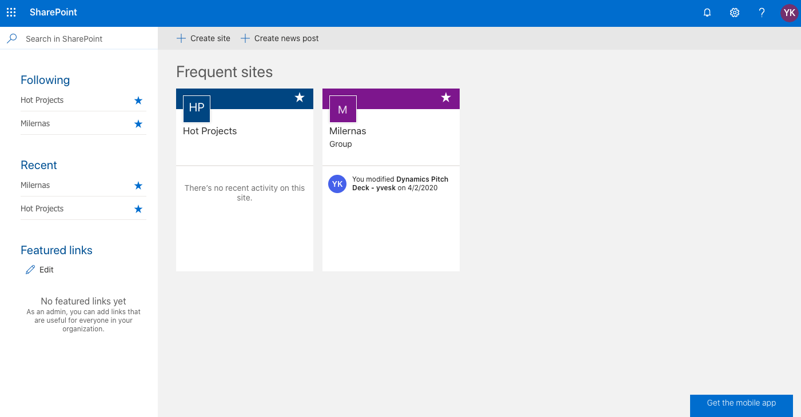
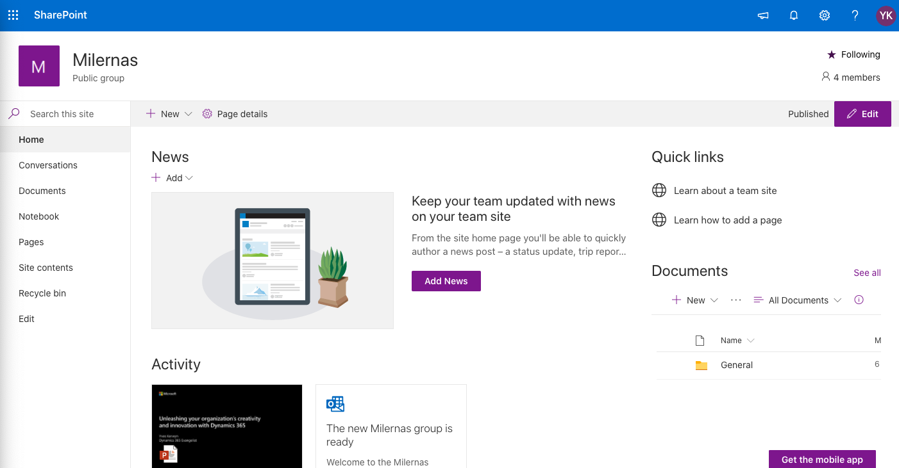
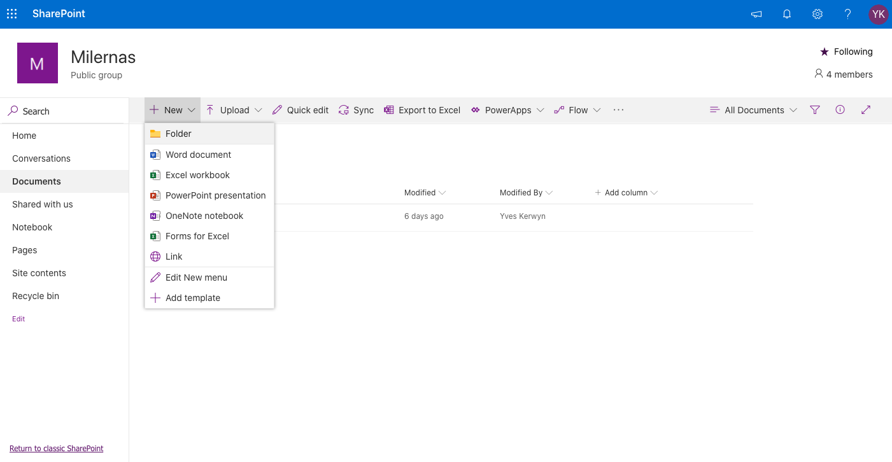
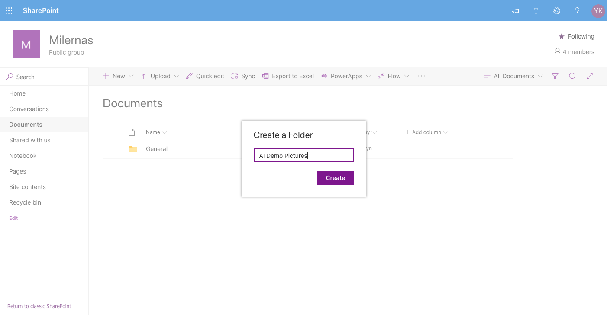
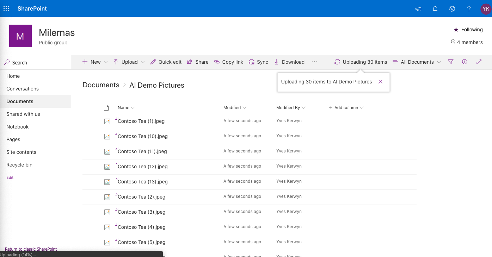

# AI Builder Demo Setup

## Demo files

Copy the Excel workbook [ProductsAI.xlsx](https://dev.azure.com/milernas/_git/XPC?path=%2Fwiki%2Fsetup%2Faibuilder%2FProductsAI.xlsx&version=GBmaster) to your OneDrive.

The [pictures used in the demo](https://dev.azure.com/milernas/_git/XPC?path=%2Fwiki%2Fsetup%2Faibuilder%2Fdemo_pictures) can be uploaded later when you build the AI model, or alternatively you can upload the pictures in a SharePoint site.

If you choose the later, go to SharePoint:

Here you can create a new SharePoint site or choose an existing one, let's choose an existing SharePoint site:

Click Documents and create a new folder:

Upload the pictures here:

