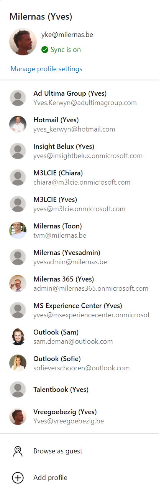
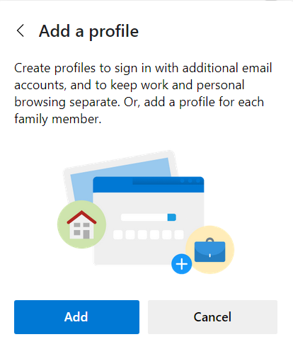
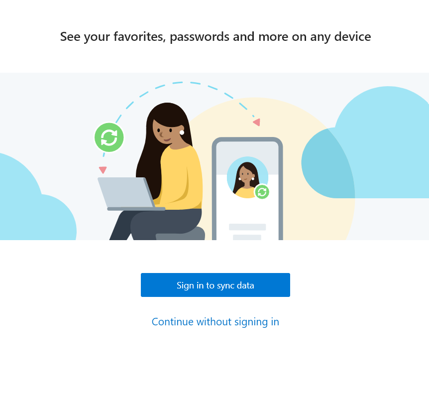
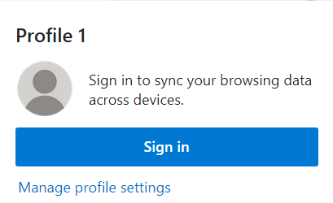
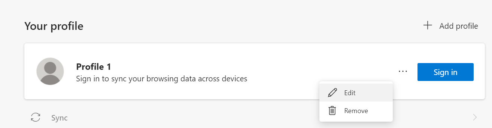
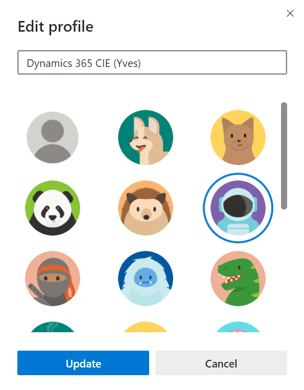
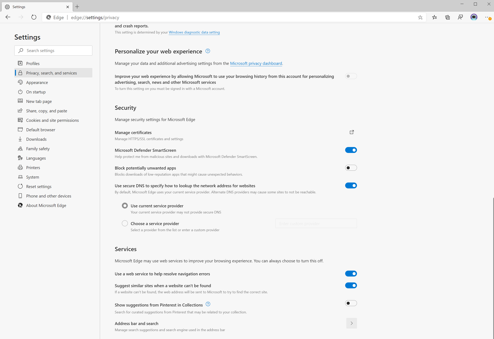
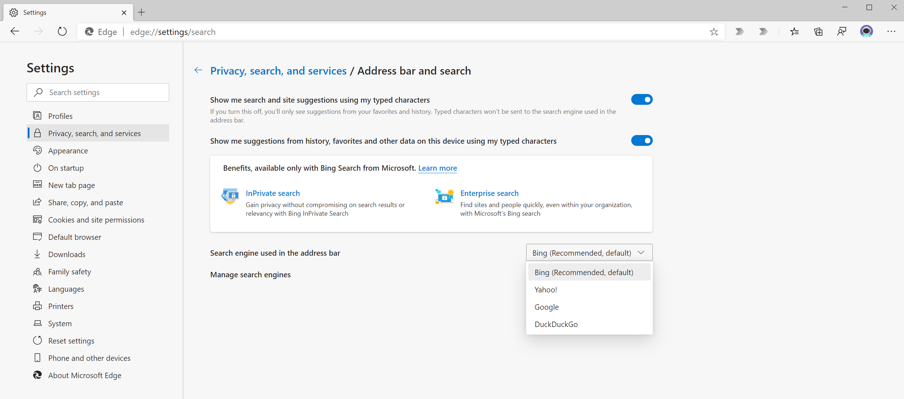
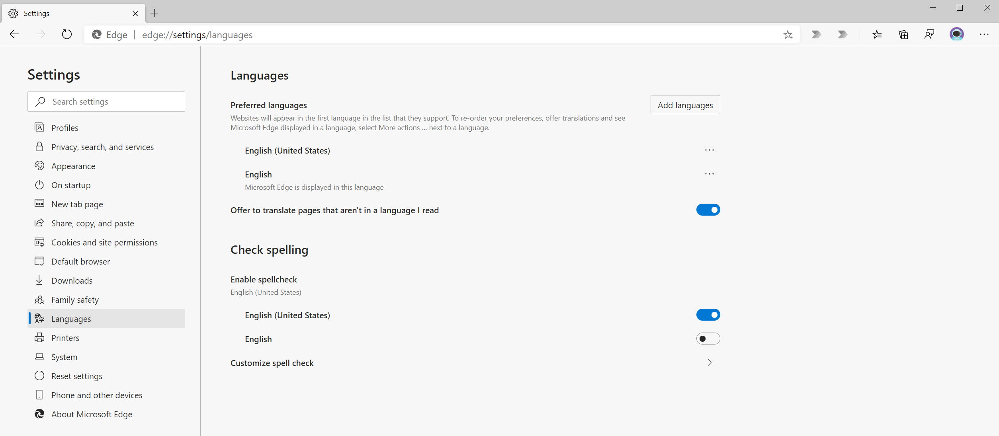

# Add New Edge Profile

In the top right of your **Edge** browser click your profile picture:

This will bring up all your profiles:

Click **Add profile** and then click **Add**

Next click **Continue without signin in**:

Click on the profile picture of your new profile and then click the link **Manage profile settings**:

Click the ellipsis next to your new profile and click **Edit**:

Rename your new profile, e.g. **Dynamics 365 CIE (your-name)**, choose a profile pictute, and click **Update**:

Optionally, in order to change your search engine, click **Privacy, search, and services**, scroll down and click **Address bar and search**:

On the next screen select your favorite search engine from the **Search engine list in the address bar** list:

Finally, you might want to review the language settings for your new profile:

## Next
 
[Start with a Microsoft 365 E5 Trial](Start-with-a-Microsoft-365-E5-Trial.md)