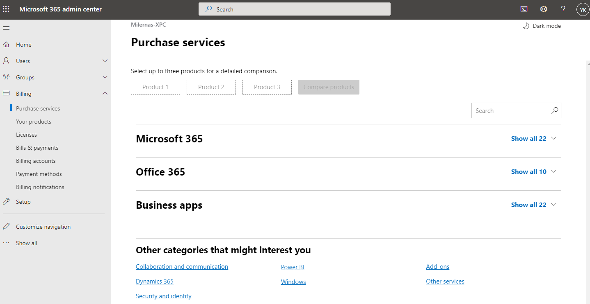
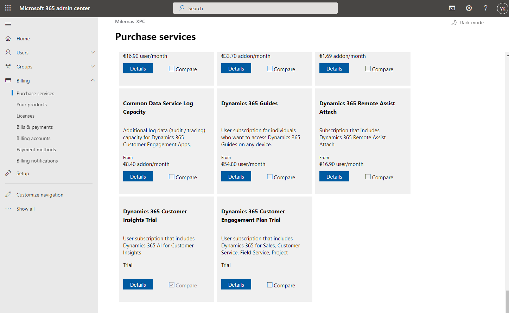
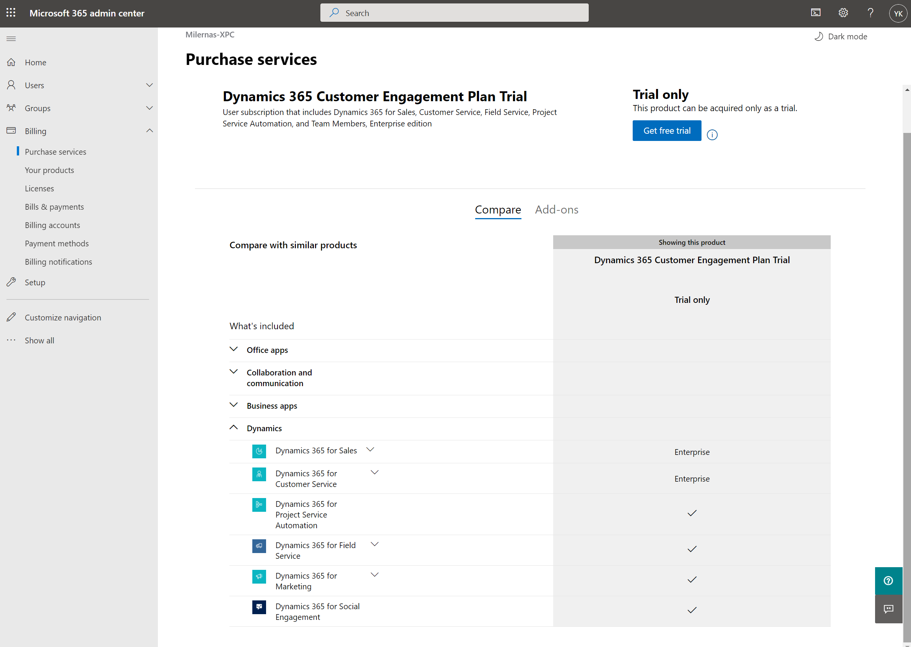
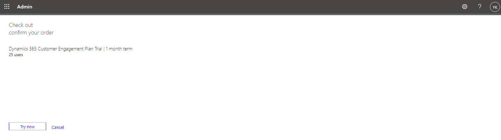
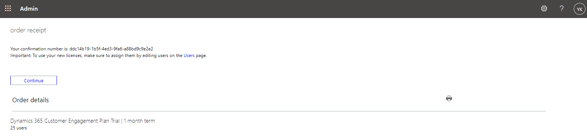
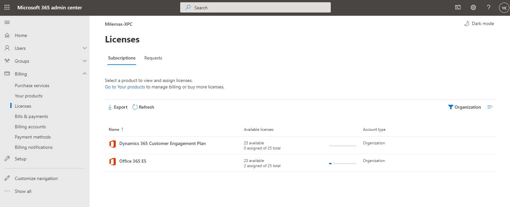

# Add the Dynamics 365 Customer Engagement Plan Trial

After having created a Microsoft 365 trial the best next step is to add a trial of the **Dynamics 365 Customer Engagement Plan**  to your tenant.

In the **Microsoft 365 admin center** navigate to **Billing** | **Purchase services**, and collaps the sections **Microsoft 365**, **Office 365** and **Business apps**:

Under **Other categories that might interest you** click **Dynamics 365**.

Scroll down and click the last tile **Dynamics 365 Customer Engagement Plan Trial**:

.

You should see this:

Click **Get free trial** and on the next screen click **Try now**:

Next click **Continue**:

Check the result under **Billing** | **Licenses**:

## Next

[Assign Licenses](Assigning-Licenses.md)