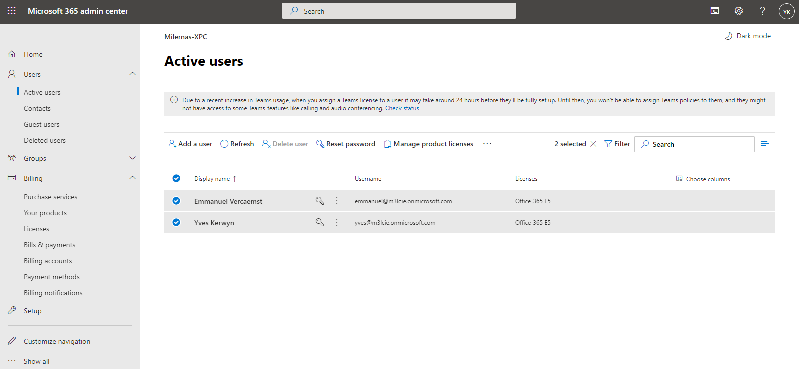
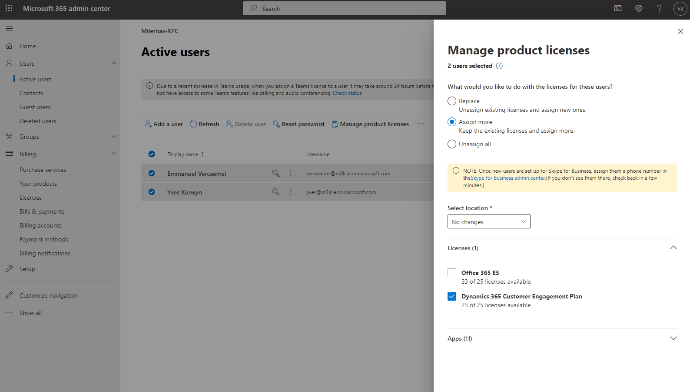
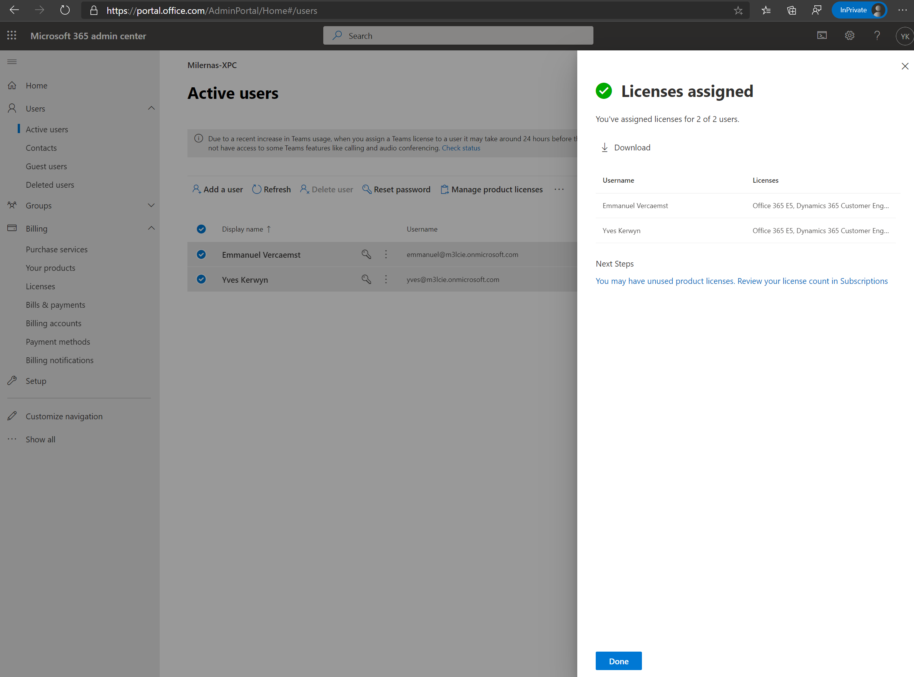
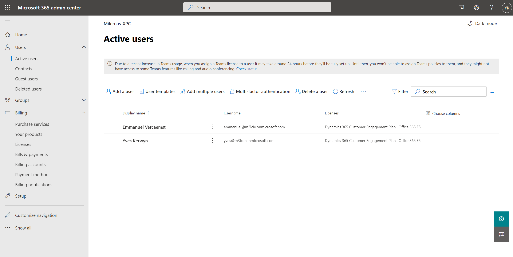

# Assign Dynamics 365 Licenses

The below steps are typically followed after having added a trial of the **Dynamics 365 Customer Engagement Plan** to your tenant.

In case your didn't yet add a trial of the **Dynamics 365 Customer Engagement Plan** plan follow the steps as documented in [Add the Dynamics 365 Customer Engagement Plan Trial](Add-the-Dynamics-365-Customer-Engagement-Plan-Trial.md)

Go to your **Microsoft 365 admin center** of your Microsoft 365 trial (https://admin.microsoft.com) and navigate to **Users** | **Active users**:

Multi-select the user to which you want to assign a trial of the **Dynamics 365 Customer Engagement Plan** license and choose **Manage product licenses** from the menu:

Choose the option to **Assign more**, select the location where the users are located, select the **Dynamics 365 Customer Engagement Plan** and click **Save changes**:

Click **Done** in the next screen:

As a result you will see again all your active users, now with the new licenses assigned:

## Next
 
[Assign Roles](Assigning-Roles.md)