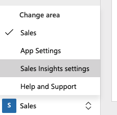

# Enable the (free) Sales Insights features

[[_TOC_]]

> Also see the documentation: [Enable and configure auto capture](https://docs.microsoft.com/en-us/dynamics365/ai/sales/configure-auto-capture).

Navigate to **Advanced Settings**:

From the **Settings** menu click **Sales Insights** under **System**:

 

Or as a Dynamics 365 Sales user navigate to **Sales Insights settings** via the **Change area** at the bottom left corner:

On the **Sales Insights settings** page, click **I agree** in the **Terms of service** section:

## Sales accelerator (preview)

Optionally activate this new feature, but not needed for the standard demo.

## Assistant (standard)

On the **Sales Insights settings** > **Global settings** page under **Overview**  click **Manage** next to **Assistant (free)**:

> Also see the documentation: [Configure and manage insight cards for Assistant (standard)](https://docs.microsoft.com/en-us/dynamics365/ai/sales/configure-assistant#configure-and-manage-insight-cards-for-assistant-free).

There's nothing do do here.

## Auto capture (standard + preview)

On the **Sales Insights settings** > **Global settings** page under **Overview** click **Manage** next to **Auto capture (free)**.

Make sure at least the **basic** auto capture features are enabled:

Enable **premium** auto capture:

Be aware that enabling premium auto capture for all security roles will disable the basic version:

 

> Also see the documentation: [Enable and configure auto capture](https://docs.microsoft.com/en-us/dynamics365/ai/sales/configure-auto-capture).

## Email engagement (standard)

In order to activate email engagement click the **Grant Permission** link next to **Need Permissions to us this feature**:

This might result in following error:

Try to refresh the page.

Click **Accept** in the permission request dialog window:

Once done you will see:

Going back the **Sales Insights settings** click **Set up** next to **Email engagement (standard)**:

You will see this:

Toggle to **Enable email engagement**:

 

Also see the documentation: [Configure and enable email engagement](https://docs.microsoft.com/en-us/dynamics365/ai/sales/configure-email-engagement).

## Next

[Sales Analytics for Dynamics 365 Sales](Sales-Analytics-for-Dynamics-365-Sales)