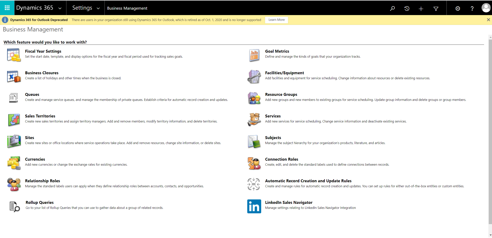
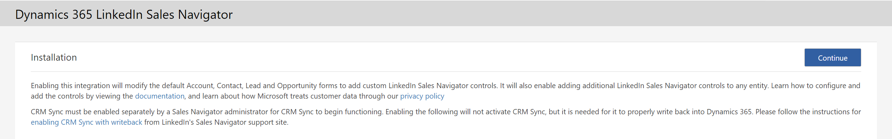

# LinkedIn Sales Navigator Integration

Go to **Advanced Settings** in your Dynamics 365 environment:

Click here (on the on the **Business Management** page) **LinkedIn Sales Navigator**, this will bring up following page:

Click **Continue** and wait until the installation has completed:

TODO: update below instructions

This will bring you back to the ynamics 365 Settings where you'll have to go back to the **LinkedIn Sales Navigator**.

Following screen will pop up:

Make sure to **Enable Sales Navigator integration**

Now you're ready to use Sales Navigator in your Dynamics 365 Sales environment.

## Next

You're done.

For an overview of all **Customer Engagement** setup steps go to [Customer Engagement Setup](Customer-Engagement-Setup.md).