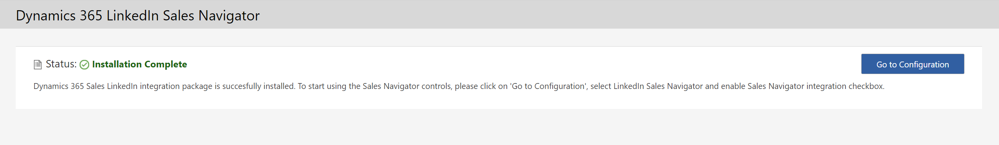
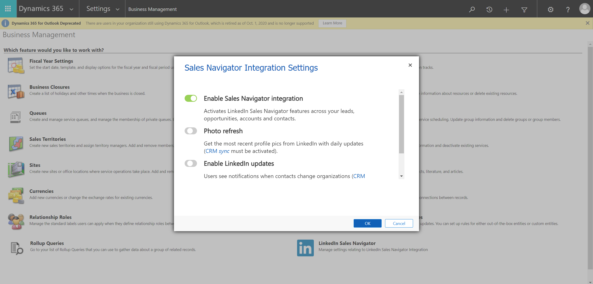

# LinkedIn Sales Navigator Integration

Go to **Advanced Settings** in your Dynamics 365 environment:

Click here (on the on the **Business Management** page) **LinkedIn Sales Navigator**, this will bring up following page:

Click **Continue** and wait until the installation has completed:

![LinkedIn-Sales-Navigator-Installing)(images/LinkedIn-Sales-Navigator-Installing.png)

Once installation has completed click **Go to Configuration**:

This will bring you back to  **Dynamics 365 Settings** where you'll have click again **LinkedIn Sales Navigator**.

On the pop-up that appears make sure to **Enable Sales Navigator integration** and then click **OK**:

Now you're ready to use Sales Navigator in your Dynamics 365 Sales environment.

## Next

You're done.

For an overview of all **Customer Engagement** setup steps go to [Customer Engagement Setup](Customer-Engagement-Setup.md).