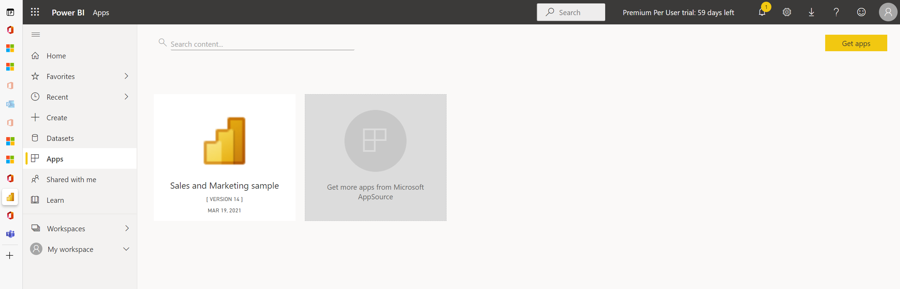

# Sales Analytics for Dynamics 365 Sales

## Documentation

https://appsource.microsoft.com/en-us/product/power-bi/microsoftd365.salesanalytics?tab=overview

Go to **Power BI**.

Click **Get data** in the left lower corner:

Click  **Get** in the **Services** tile.

In AppSource seach fot **Sales Analyzer** and click the **Sales Analytics for Dynamics 365 Sales** tile:

Click **GET IT NOW**:

Specify out the requested information and then click **Continue**:

Click **Install**:

Once installed click it:

## Next

[LinkedIn Sales Navigator Integration](LinkedIn-Sales-Navigator-Integration.md)