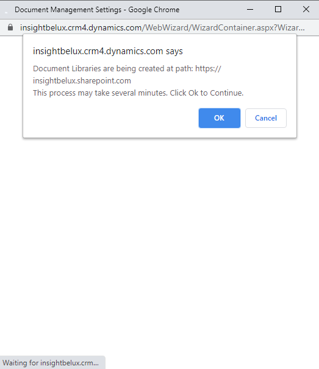

# SharePoint Integration

In order to be able to save documents in Dynamics 365 Sales we need to setup SharePoint integration.

Go to **Advanced Settings** of your Dynamics 365 environment.

Go to **Settings** | **System** | **Document Management**:

Here we have to click on **Enable Server-Based SharePoint Integration**:

Follow the steps as show below, in the third step provide the link to your SharePoint environment which is https://{your-domain-name}.sharepoint.com:

In the last step click **Finish**.

Next click  **Document Management Settings**:

In the **Document Management Settings** windows copy the SharePoint URL and click **Next**:

Also in the next step click **Next**:

Next click **OK**: 

And finally click **Finish**:

 ## Next

 [Enable the Sales Insights features](Enable-the-Sales-Insights-features.md)