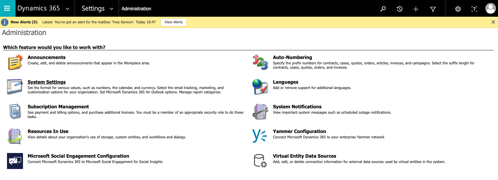
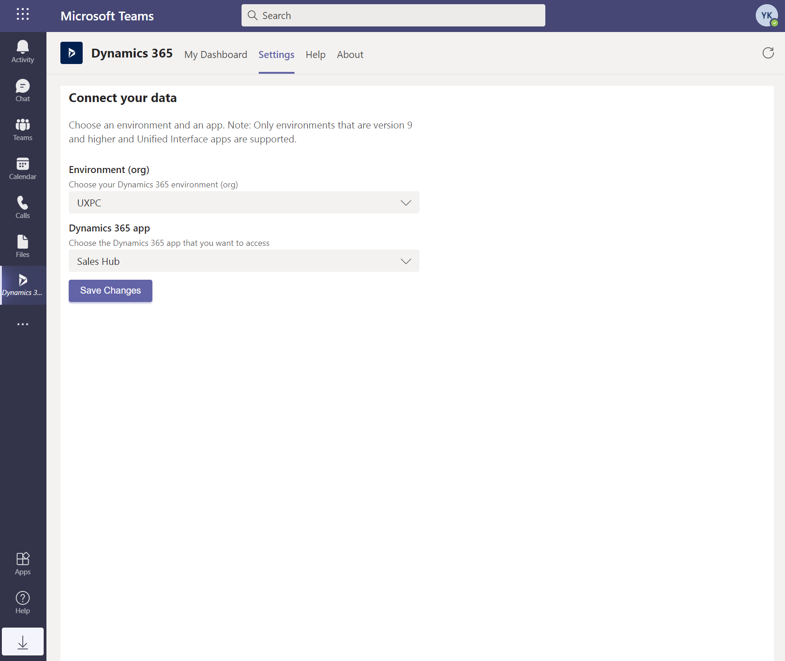

# Teams Integration

[[_TOC_]]

Documentation:
[Install and setup Microsoft Teams integration](https://docs.microsoft.com/en-us/dynamics365/teams-integration/teams-install-app)

## Basic Integration

Go to **System Administration**:

From there go to **System Settings**:

In **General** tab first enable **Basic** Microsoft Teams integration:

Next click **Finish**:

As a result you can now also enable **Enhanced** Teams integration:

> It is best that you first close the **System Settings** and reopen to enable the **Enhanced** integration.

## Enhanced Integration

When you choose **Yes** for the **Enhanced** integration Click **OK** in the pop-up window, and then authenticate as a global admin:

 

This will bring up another pop-up that will probably be blocked by your browser:

Unblock the pop-up:

And finally click **Finish** again:

Both **Basic** and **Enhanced** integration are enabled now, you can close the System Settings:

## Dynamics 365 Teams add-in

In Teams click the **Apps** icon in the left navigation pane and search for **Dynamics 365**:

Select **Dynamics 365**:

Click **Add**, and then **Configure**:

Choose your environment and that click **Save**:

Check the **Consent on behalf of your organization** option and acccept the requested permissions:

## Next

[Enable the Sales Insights features](Enable-the-Sales-Insights-features.md).