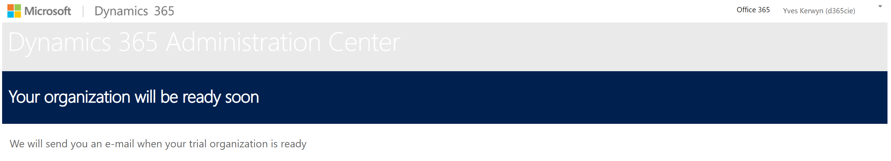

# Marketing Setup

Go to the Marketing trial page:
https://trials.dynamics.com/Dynamics365/marketing

Enter the e-mail of your admin account and hit **Get Started**:

On the next page click **Sign in**:

You will get a message that you already have a license for Marketing:

After clicking **OK, got it** setting will start:

marketing-address
...

After a while you will be requested to specify the physical street address of your organization, enter "Groeningenlei 16, 2550 Kontich" and click **Get started**:

In case the address is not yet on record for you will get invited to accept some permissions, do this with the **Consent on behalf of your organization** checked:

Also accept the similar next permissions request:

And next provide you consent for the following:

You're done:

Click **Begin**.

## Adding users

Other users can also start a trial... this will result in an e-mail asking you to approve/reject the request to join the marketing trial by following the same procedure as outlined above starting by going to https://trials.dynamics.com/Dynamics365/marketing:

After clicking **Get started** they'll need to sign in:

They will receive a confirmation that their organization/company already have a free trial of Dynamics 365 Marketing:

After having clicked on **OK, got it** they will get navigated to the following page, where they need to click **Join**:

This brings up following dialog window where they need to click **Continue**:

As a result they will get a confirmation that their request to join was sent to the owner of the trial:

After the request to join has been accpeted the requesting user can click the **View trial instances** link in the last dialog which will bring him here:

Clicking **Open** brings them to the Marketing trial:

## Environments

Go to **Power Platform admin center**:
https://admin.powerplatform.microsoft.com/environments

Notice that a new environment has been created as a result of installing a trial of the Marketing app.

Click the newly added environment:

Click **Edit**:

Update both the name and URL:

This will actually change nothing, but rather will help avoid confusing when adding other applications to the environments.

Optionally you can add the marketing app to the environment where the sales app was created. In order to do so go to the overview page of all Dynamics 365 apps that are installed in this environment:

  

Click **Install app*, choose the **Dynamics 365 Marketing Application** from the list and click **Next**:

Click **OK**:

You will be requested to enter the physical street address of your organization, enter "Groeningenlei 16, 2550 Kontich" and click **Setup**::

## Next

Following the steps documented in [Customer Service Setup](/setup/Customer-Service-Setup)
