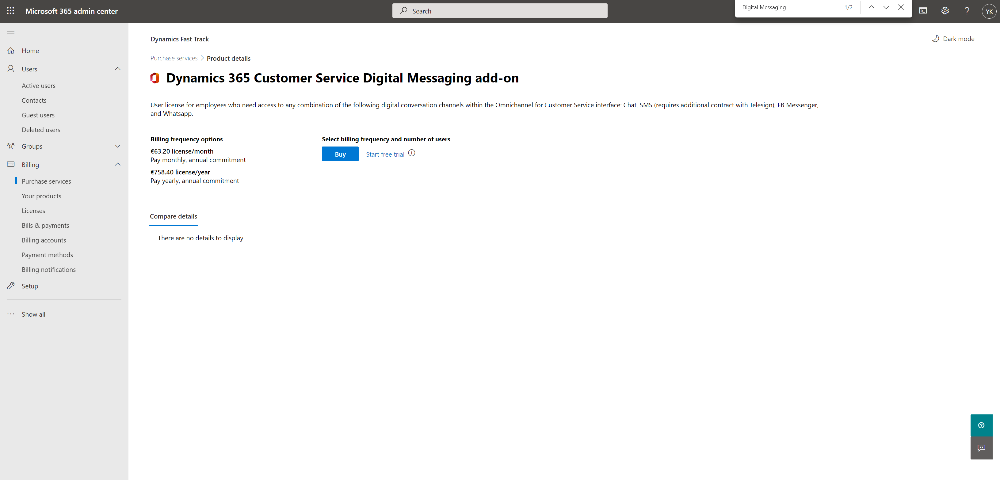
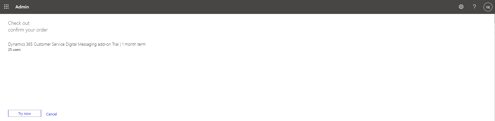

# Add a trial of the Dynamics 365 Customer Service Digital Messaging add-on

Go to the Microsoft 365 admin center: admin.microsoft.com.

Navigate to **Billing** | **Purchase services**, scroll down and click **Add-ons**:

In the list with all available add-ons scroll down, check if **Dynamics 365 Customer Service Digital Messaging add-on** is listed.

> If the **Digital Messaging add-on** is not listed skipp all next steps and install a trial of **Dynamics 365 Customer Service** (yes even if this app is already included in your Customer Engagement trial) via https://trials.dynamics.com, and once done proceed to [Provision Omnichannel for Customer Service](Provision-Omnichannel-for-Customer-Service). This will add another environment with only the Customer Service app, and also add **Chat for Dynamics 365 Customer Service** or **Dynamics 365 Digital Messagingg**, which is required in order to complete the **Omnichannel for Customer Service** setup.

Click **Details** in the **Dynamics 365 Customer Service Digital Messaging add-on** tile:

Click the **Get free trial** link:

Click the **Try now** button:

Click the **Continue** button:

Next we will assign the trial license to the users. In **Billing** | **Licenses** click the license:

Click **+ Assign licenses**, specify the users, make sure both apps are selected, and click **Assign**:

## Next

[Provision Omnichannel for Customer Service](Provision-Omnichannel-for-Customer-Service.md)