# Configure Chat Widget

Make sure you have followed the steps in [Provision Omnichannel for Customer Service](Provision-Omnichannel-for-Customer-Service).

Go to the **Omnichannel Administration** app via [Power Apps Maker Portal](https://make.powerapps.com) or via the [Dynamics 365 Home](https://home.dynamics.com/) - shown hereunder:

> Make sure to select the **Omnichannel Administration** app in the correct environment.

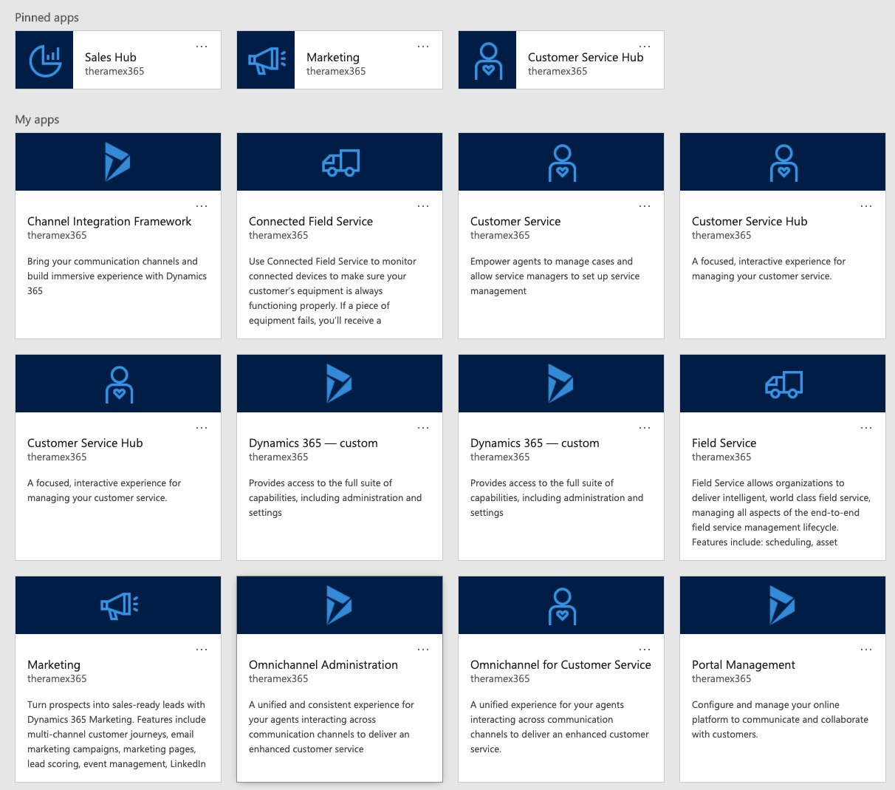

Verify wether there is a **Live chat workstream** listed in the **Workstreams**:

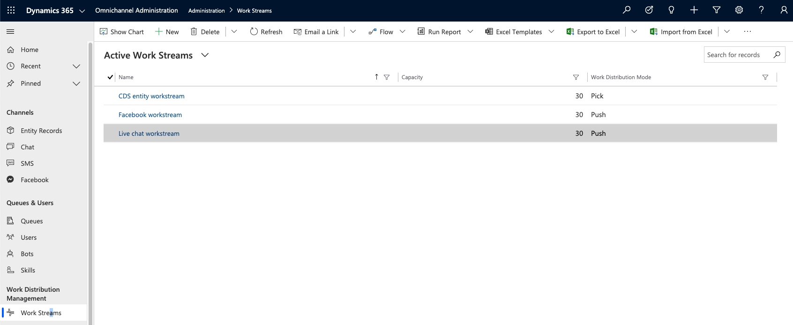

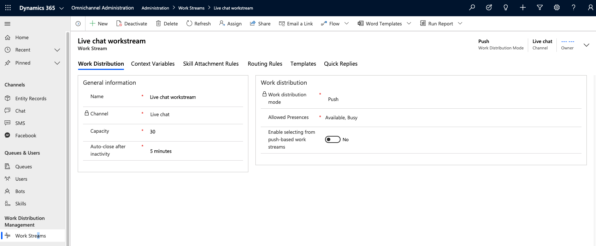

Go to **Channels** > **Chat**:

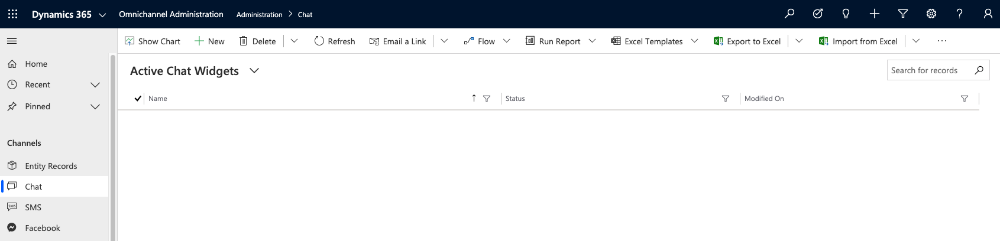

Click **New** to create a chat widget:

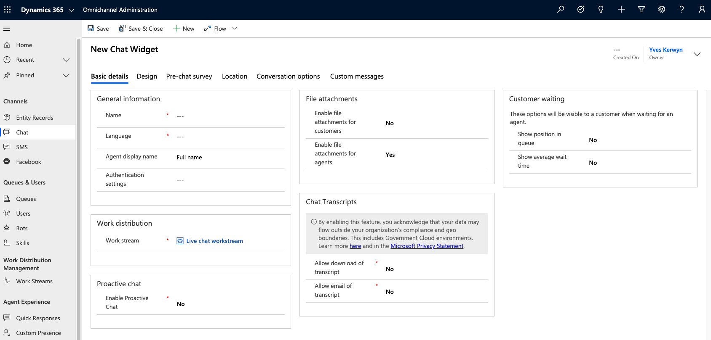

Specify a name for the widget, e.g. **Customer Portal Chat**, specify **English**  as the language, make sure the work stream is set to the **Live chat workstream**, and hit **Save**:

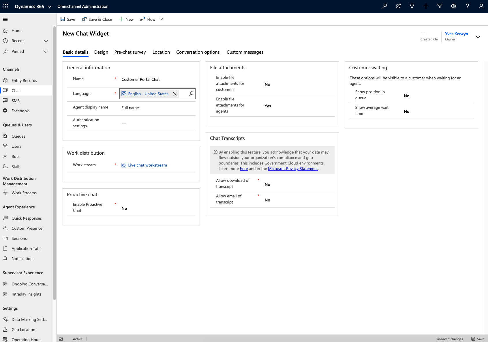

Copy the **code snippet** code:

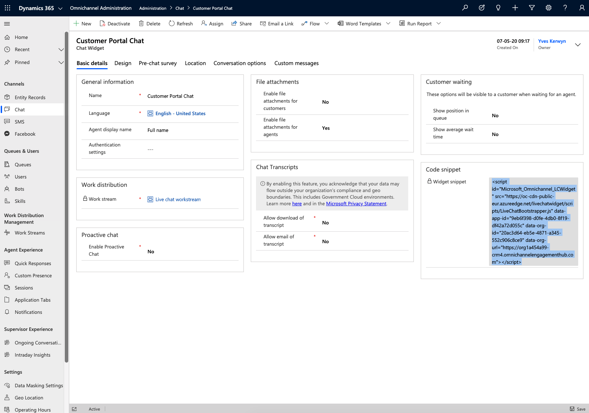

From the **Power Apps Maker Portal** open the **Portal Management** app:

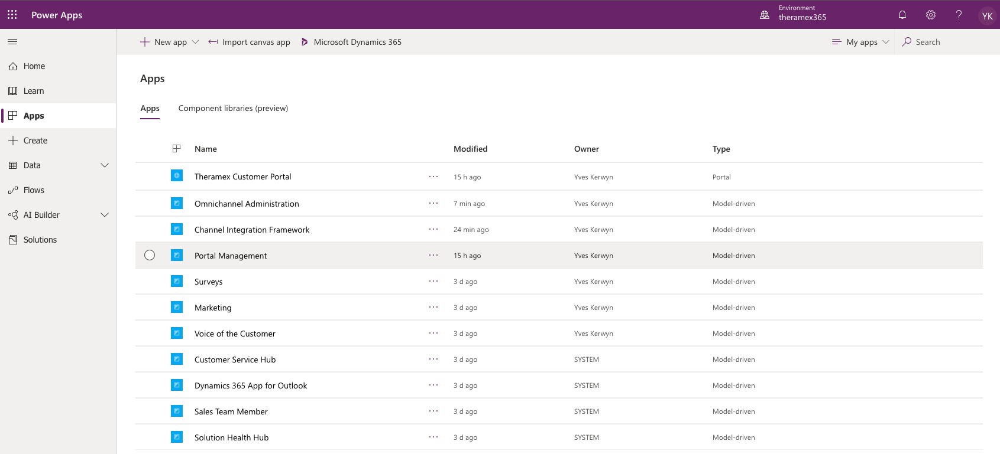

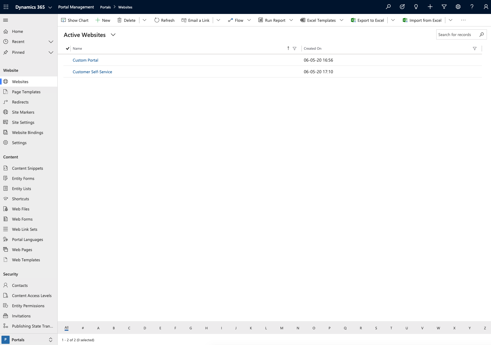

Go to **Content** > **Content Snippets**, and find the **Chat Widget Code**:

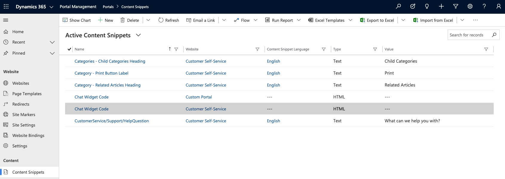

Open the **Chat Widget Code**, go to the HTML tab, paste the code snippet from the Chat Widget here, and click **Save**:

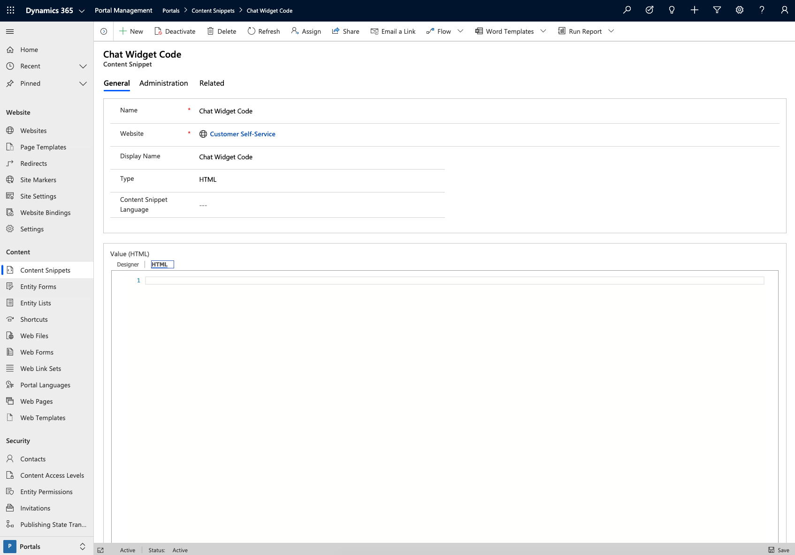

## Documentation

- [Quickly configure a chat widget](https://docs.microsoft.com/en-us/dynamics365/omnichannel/administrator/configure-live-chat)

## Troubleshooting

- [Clear the server-side cache for a portal](https://docs.microsoft.com/en-us/powerapps/maker/portals/admin/clear-server-side-cache)

  > Create user and assign him to to Administrators role and then login to the portal with following with https://<portal_path>/_services/about:

  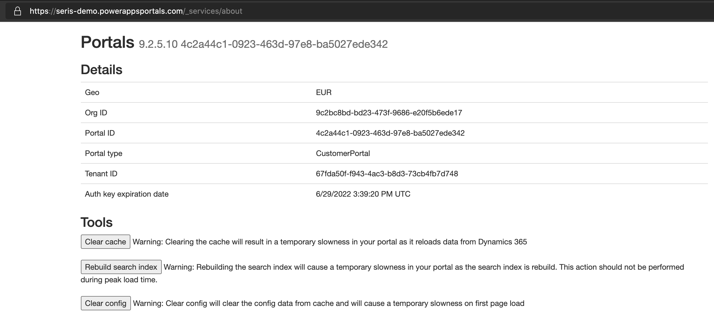

- [Chat widget does not load on the portal](https://docs.microsoft.com/en-us/dynamics365/omnichannel/troubleshoot-omnichannel-customer-service#chat-widget-does-not-load-on-the-portal)

  > Make sure a location record exists - which might not be the case as shown hereunder:

  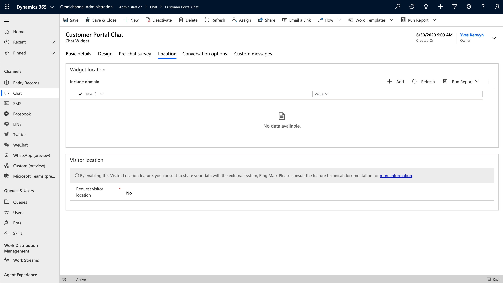

  > Add a location record - here seris-demo.powerappsportals.com (**DO NOT INCLUDE HTTTPS**):

  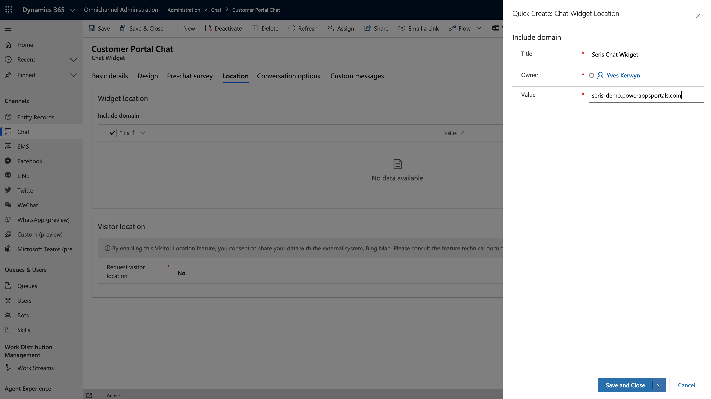

- [Chat widget icon does not load on the portal](https://docs.microsoft.com/en-us/dynamics365/omnichannel/troubleshoot-omnichannel-customer-service#chat-widget-icon-does-not-load-on-the-portal)

   > Make sure the Logo URL is correct: https://oc-cdn-ocprod.azureedge.net/livechatwidget/images/chat.svg

  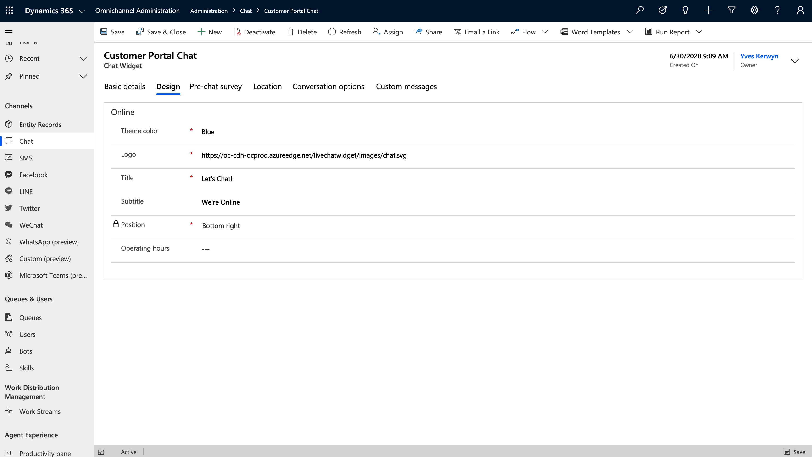

- [Chat not getting initiated on starting a new chat from portal](https://docs.microsoft.com/en-us/dynamics365/omnichannel/troubleshoot-omnichannel-customer-service#chat-widget-icon-does-not-load-on-the-portal)

 ## Next

 [Test Omnichannel for Customer Service](Test-Omnichannel.md)