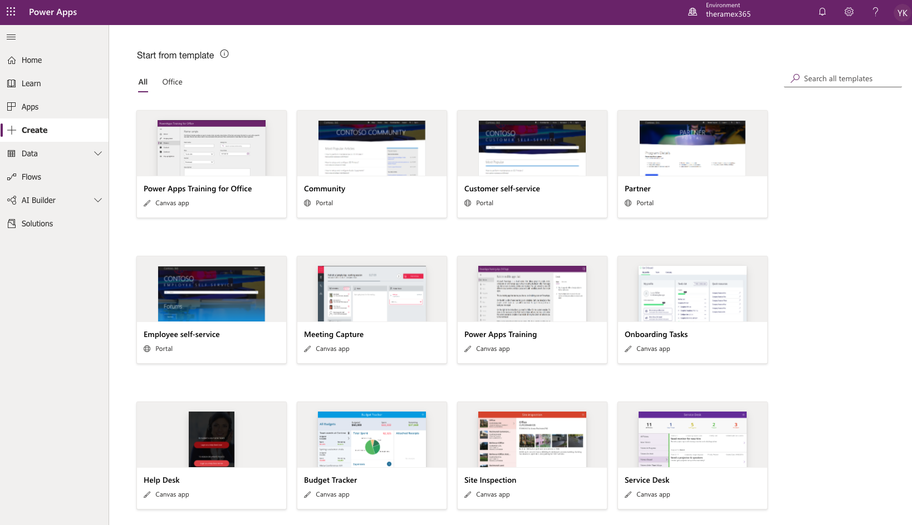
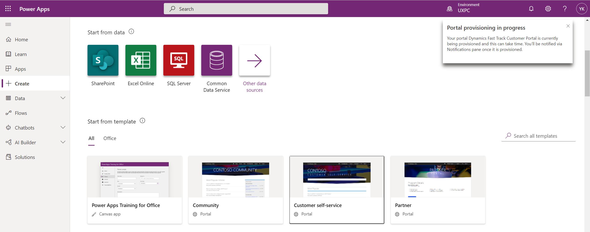

# Customer Portal Setup

## Create the portal

Go to the **Power Apps Maker Portal**:
http://make.powerapps.com/

Switch to the environment where you set up the Dynamics 365 trials:

> It is easy to make a mistake here, e.g. if you created Marketing trial you typically end up with a second environment, make sure not to use that environment

Navigate to the **Create** and scroll down to the **Start from template** section:

Select the **Customer self-service** template, provided the requested information and **Create**:

Once the portal is ready to use, click **Settings** from the context menu of the portal under **Apps**:

This opens open a side pane:

In this side pane click **Site settings** which will open the **Portal Management** app:

 

## Create a portal User

In the **Portal Management** app go to **Contacts**:

Click **New**:

In the new contact switch to the **Portal contact** form:

Create a new contact Sam De Man with e-mail address sam.deman@outlook.com, and for **Company Name** create a new account record (Aliman):

Click **Save** and than click the **Web Authentication** tab:

Enter **sam** as the username for Sam and enable login:

Click **Create Invitation**:

Check the mailbox of Sam Deman:

Click the link will not work, extra configuration is required...

Instead manually set a password...

Next click **Change Password** in the menu and set a password (samLovesD365!!):

Test the login by visiting the customer portal and clicking Sign-in:

This will open the **Profile** page of Sam:

## Next

[Add a trial of the Dynamics 365 Customer Service Digital Messaging add-on](Add-a-trial-of-the-Dynamics-365-Customer-Service-Digital-Messaging-add%2Don.md)