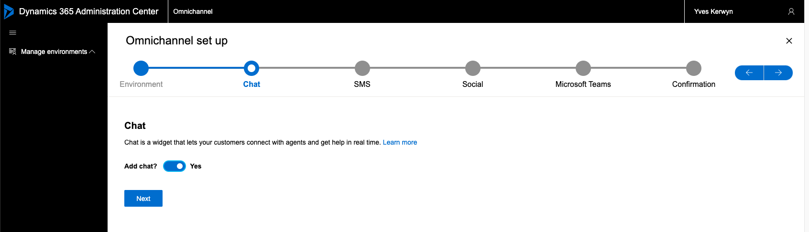

# Provision Omnichannel for Customer Service

In order to provision Omnichannel we must have a license of the Dynamics 365 Customer Service Digital Messaging add-on. If that is not yet the case first follow the steps as documented in [Add a trial of the Dynamics 365 Customer Service Digital Messaging add-on](Add-a-trial-of-the-Dynamics-365-Customer-Service-Digital-Messaging-add%2Don.md)

## Data access consent

> See documentation [Provision Omnichannel for Customer Service](https://docs.microsoft.com/en-us/dynamics365/omnichannel/administrator/omnichannel-provision-license)

Go to the **Data access consent** URL:
https://go.microsoft.com/fwlink/?linkid=2070932

Accept the requested permissions:

## Provision Omnichannel into your first environment

Go to the **Power platform admin center** via https://aka.ms/ppac, navigate to the Dynamics 365 apps that haven been installed on the tenant level, scroll down to the **Omnichanel for Customer Service** application and choose **Manage** from the context menu: https://admin.powerplatform.microsoft.com/resources/applications

Click **OK**:

Accept the requested permissions:

Click **+ Add environment**:

Next you need to select the correct environment, which is tricky, I took the first one guessing that is the first environment that was created when adding the Sales trial:

Go through the wizard:

 

The actual setup can take qiet some time:

> Here you see the URL of the environment in which the Omnichannels gets provisioned, clicking it will actually reveil that the first environment in the list was actually the first environment.

> Provision takes a very long time, more than one hour...

If you get an error at some point, don't worry, just click the error away, probably the installation is still in progress:

After 1 hour all finished without errors:

## Documentation

- [Try channels in Omnichannel for Customer Service](https://docs.microsoft.com/en-us/dynamics365/omnichannel/try-channels)
- [Installing Omnichannel for Dynamics 365 (Trial) – Part I](https://thecrm.ninja/installing-omnichannel-for-dynamics-365-trial-part-i/)
- [Installing Omnichannel for Dynamics 365 (Trial) – Part II](https://thecrm.ninja/installing-omnichannel-for-dynamics-365-trial-part-ii/)
- [Omnichannel for Customer Service and Power Virtual Agents](https://neilparkhurst.com/2020/01/01/omnichannel-for-customer-service-and-power-virtual-agents/)
- [Omnichannel for Customer Service – Part 1](https://learningrefresh.home.blog/2020/06/14/omnichannel-for-customer-service/)
- [Omnichannel for Customer Service – Part 2](https://learningrefresh.home.blog/2020/06/16/omnichannel-for-customer-service-part-2/)
- [Provision - Omnichannel for Dynamics 365 Customer Service](https://nishantrana.me/2020/06/11/provision-omnichannel-for-dynamics-365-customer-service/)

## Next

[Configure Chat Widget](Configure-Chat-Widget.md)