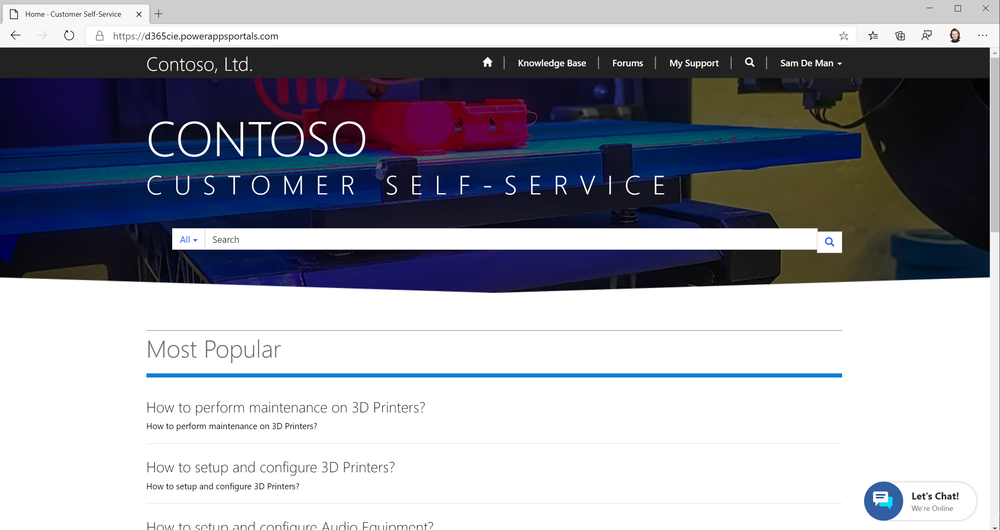
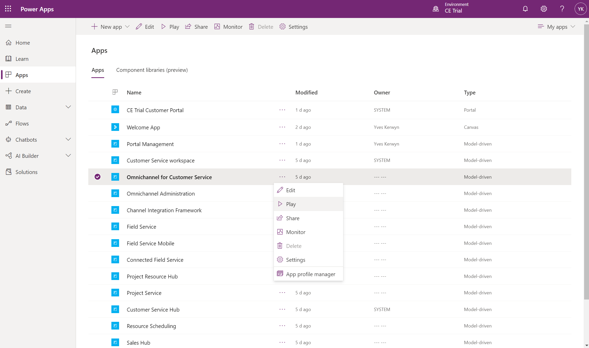

# Test Omnichannel for Customer Service

Using the **Edge Profile** of **Sam** navigate to the customer self-service portal:

You should see the **Chat Widget** in the bottom right corner.

Using your own **Edge Profile** navigate to the **Omnichannel for Customer Service** app, e.g. via the **Dynamics 365 My Apps** page (https://{your-environment}.crm4.dynamics.com) or as shown here below via de **Power Apps Maker Portal**:

In case - as shown above - no presence information is shown, check wether the user has been assigned the **Omnichannel for Customer Service** security role.

## Next

[Setup Power Virtual Agents and Omnichannel for Customer Service](Setup-Power-Virtual-Agents-and-Omnichannel-for-Customer-Service.md)