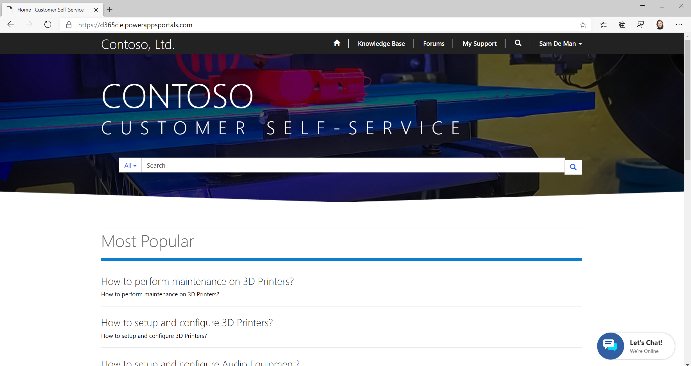
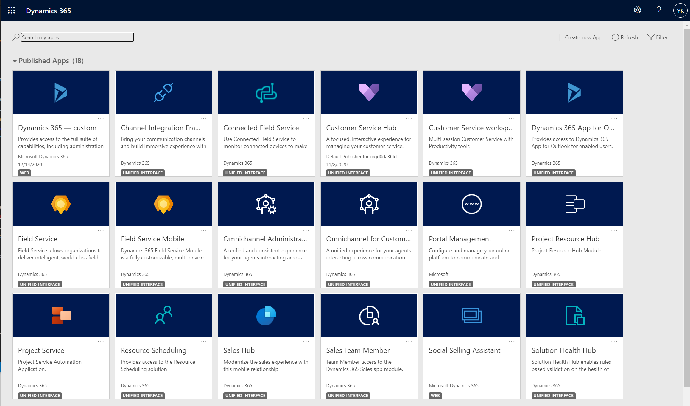
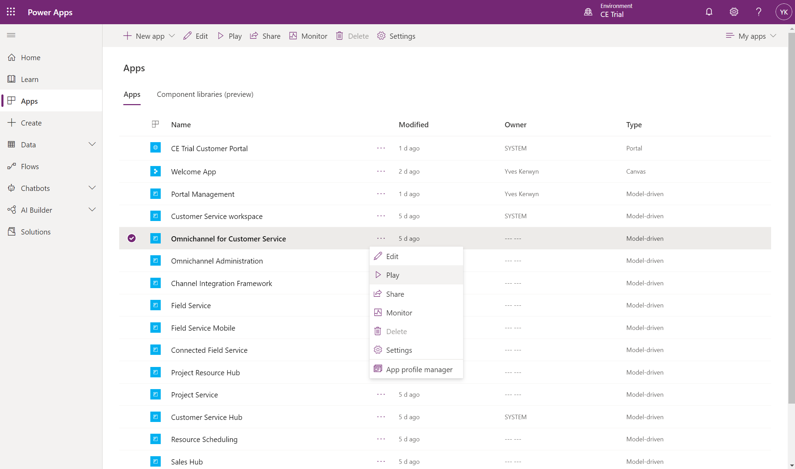

# Test Virtual Agent

Using the **Edge Profile** of **Sam** navigate to the customer self-service portal:

You should see the **Chat Widget** in the bottom right corner.

Using your own **Edge Profile** navite to the **Omnichannel for Customer Service** app, e.g. via the **Dynamics 365 My Apps** page (https://{your-environment}.crm4.dynamics.com/main.aspx?forceUCI=1&pagetype=apps):

Or as shown here below via the **Power Apps Maker Portal**:

When Sam starts a conversation on the home page he will first talk to the virtual agent, and when he says "Talk to agent" he will be transferred to the Omnichannel agent thay is availble through the Omnichannel for Customer Service app.

For all other pages on the Customer Self-Service Portal using the chat widget will allways directly transfer the call the a human agent.

## Next

You're done.

For an overview of all **Omnichannel for Customer Service** setup steps go to [Setup Omnichannel for Customer Service](Omnichannel-Setup.md).